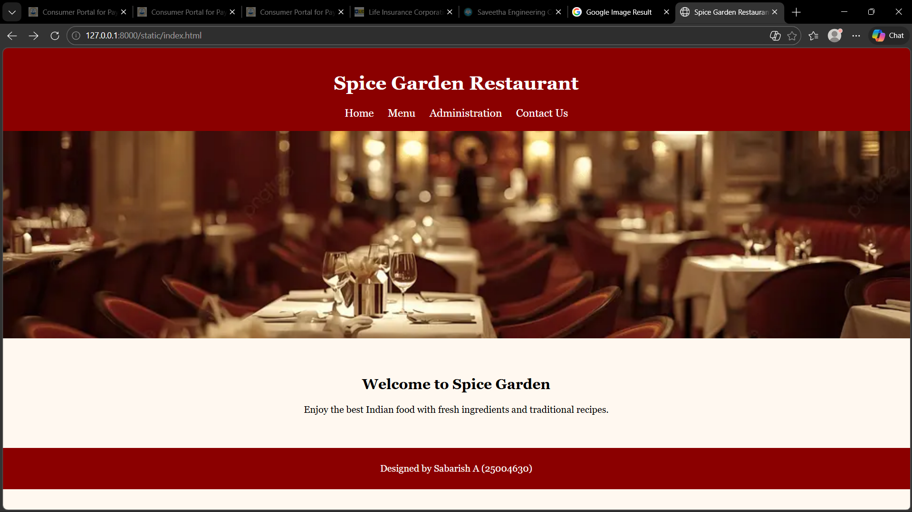
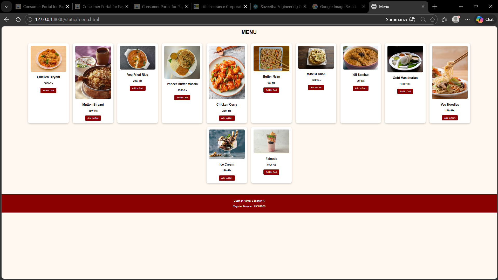
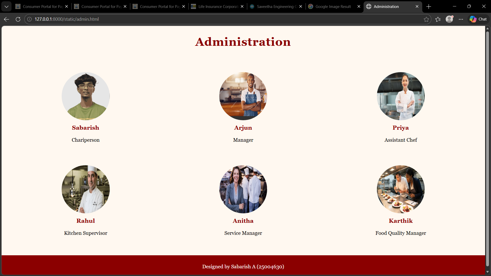
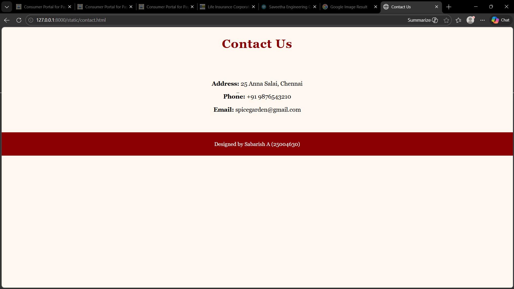

# Ex.06 Restaurant Website
## Date:13.3.2026

## AIM:
To develop a static Restaurant website to display the food items and services provided by them.

## DESIGN STEPS:

### Step 1:
Requirement collection.

### Step 2:
Creating the layout using HTML and CSS.

### Step 3:
Updating the sample content.

### Step 4:
Choose the appropriate style and color scheme.

### Step 5:
Validate the layout in various browsers.

### Step 6:
Validate the HTML code.

### Step 7:
Publish the website in Localhost.

## PROGRAM:
```
index.html
<!DOCTYPE html>
<html>
<head>
<title>Spice Garden Restaurant</title>
<link rel="stylesheet" href="style.css">
</head>

<body>

<header>
<h1>Spice Garden Restaurant</h1>

<nav>
<a href="index.html">Home</a>
<a href="menu.html">Menu</a>
<a href="admin.html">Administration</a>
<a href="contact.html">Contact Us</a>
</nav>
</header>

<div class="banner">

</div>

<section class="home">
<h2>Welcome to Spice Garden</h2>
<p>Enjoy the best Indian food with fresh ingredients and traditional recipes.</p>
</section>

<footer>
<p>Designed by Sabarish A (25004630)</p>
</footer>

</body>
</html>

menu.html

<!DOCTYPE html>
<html>
<head>
<title>Menu</title>
<link rel="stylesheet" href="menu.css">
</head>

<body>

<h1 class="title">MENU</h1>

<div class="menu">

<div class="food">

<h3>Chicken Biryani</h3>
<p>300/-Rs</p>
<button>Add to Cart</button>
</div>

<div class="food">

<h3>Mutton Biryani</h3>
<p>350/-Rs</p>
<button>Add to Cart</button>
</div>

<div class="food">

<h3>Veg Fried Rice</h3>
<p>200/-Rs</p>
<button>Add to Cart</button>
</div>

<div class="food">

<h3>Paneer Butter Masala</h3>
<p>250/-Rs</p>
<button>Add to Cart</button>
</div>

<div class="food">

<h3>Chicken Curry</h3>
<p>280/-Rs</p>
<button>Add to Cart</button>
</div>

<div class="food">

<h3>Butter Naan</h3>
<p>60/-Rs</p>
<button>Add to Cart</button>
</div>

<div class="food">

<h3>Masala Dosa</h3>
<p>120/-Rs</p>
<button>Add to Cart</button>
</div>

<div class="food">

<h3>Idli Sambar</h3>
<p>80/-Rs</p>
<button>Add to Cart</button>
</div>

<div class="food">

<h3>Gobi Manchurian</h3>
<p>160/=Rs</p>
<button>Add to Cart</button>
</div>

<div class="food">

<h3>Veg Noodles</h3>
<p>180/-Rs</p>
<button>Add to Cart</button>
</div>

<div class="food">

<h3>Ice Cream</h3>
<p>120/-Rs</p>
<button>Add to Cart</button>
</div>

<div class="food">

<h3>Falooda</h3>
<p>150/-Rs</p>
<button>Add to Cart</button>
</div>

</div>

<footer>
<p>Learner Name: Sabarish A</p>
<p>Register Number: 25004630</p>
</footer>

</body>
</html>


admin.html

<!DOCTYPE html>
<html>
<head>
<title>Administration</title>
<link rel="stylesheet" href="style.css">
</head>

<body>

<h1 class="title">Administration</h1>

<div class="team">

<div class="member">

<h3>Sabarish</h3>
<p>Chariperson</p>
</div>

<div class="member">

<h3>Arjun</h3>
<p>Manager</p>
</div>

<div class="member">

<h3>Priya</h3>
<p>Assistant Chef</p>
</div>

<div class="member">

<h3>Rahul</h3>
<p>Kitchen Supervisor</p>
</div>

<div class="member">

<h3>Anitha</h3>
<p>Service Manager</p>
</div>

<div class="member">

<h3>Karthik</h3>
<p>Food Quality Manager</p>
</div>

</div>

<footer>
<p>Designed by Sabarish A (25004630)</p>
</footer>

</body>
</html>


contact.html


<!DOCTYPE html>
<html>
<head>
<title>Contact Us</title>
<link rel="stylesheet" href="style.css">
</head>

<body>

<h1 class="title">Contact Us</h1>

<div class="contact">

<p><b>Address:</b> 25 Anna Salai, Chennai</p>

<p><b>Phone:</b> +91 9876543210</p>

<p><b>Email:</b> spicegarden@gmail.com</p>

</div>

<footer>
<p>Designed by Sabarish A (25004630)</p>
</footer>

</body>
</html>


menu.css


body{
font-family: Arial;
background:#fff8f0;
margin:0;
}

.title{
text-align:center;
margin:20px;
}

.menu{
display:flex;
flex-wrap:wrap;
justify-content:center;
gap:25px;
padding:30px;
}

.food{
width:220px;
background:white;
padding:15px;
text-align:center;
border-radius:10px;
box-shadow:0 4px 10px rgba(0,0,0,0.2);
transition:0.3s;
}

.food img{
width:100%;
border-radius:8px;
transition:0.3s;
}

.food p{
font-weight:bold;
}

button{
padding:8px 15px;
border:none;
background:#8B0000;
color:white;
border-radius:5px;
cursor:pointer;
margin-top:5px;
}

.food:hover{
transform:translateY(-10px);
box-shadow:0 10px 20px rgba(0,0,0,0.3);
}

.food:hover img{
transform:scale(1.08);
}

button:hover{
background:#ff4500;
}

footer{
background:#8B0000;
color:white;
text-align:center;
padding:15px;
margin-top:40px;
}


style.css


body{
font-family: Georgia, "Times New Roman", serif;
margin:0;
background:#fff8f0;
}

/* HEADER */

header{
background:#8B0000;
color:white;
padding:20px;
text-align:center;
}

nav a{
color:white;
margin:10px;
text-decoration:none;
font-size:18px;
}

/* BANNER */

.banner img{
height:350px;
object-fit:cover;
}

/* HOME SECTION */

.home{
text-align:center;
padding:40px;
}

/* MENU */

.menu{
display:grid;
grid-template-columns:repeat(3,1fr);
gap:20px;
padding:30px;
}

.food{
background:#ffcc99;
padding:20px;
text-align:center;
font-weight:bold;
border-radius:10px;
}

/* TEAM SECTION */

.team{
display:grid;
grid-template-columns:repeat(3,1fr);
gap:25px;
padding:30px;
text-align:center;
}

.member{
padding:15px;
transition:0.3s;
}

.member:hover{
transform:translateY(-8px);
}

.member img{
width:150px;
height:150px;
border-radius:50%;
transition:0.3s;
}

.member img:hover{
transform:scale(1.1);
box-shadow:0 6px 15px rgba(0,0,0,0.3);
}

.member h3{
color:#8B0000;
margin-top:10px;
}

/* CONTACT */

.contact{
text-align:center;
font-size:18px;
padding:40px;
}

/* TITLES */

.title{
text-align:center;
font-size:36px;
margin:30px 0;
color:#8B0000;
letter-spacing:1px;
}

/* FOOTER */

footer{
background-color: #8B0000;
color:white;
text-align:center;
padding:10px;
}


```

## OUTPUT:




## RESULT:
The program for designing software company website using HTML and CSS is completed successfully.
